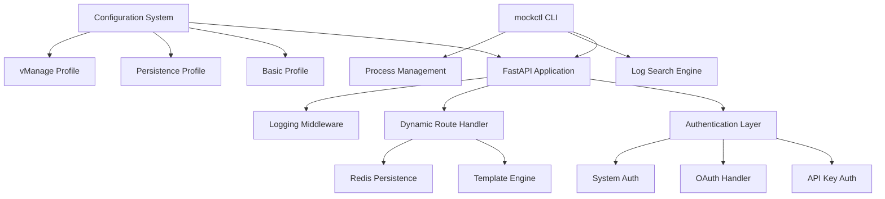
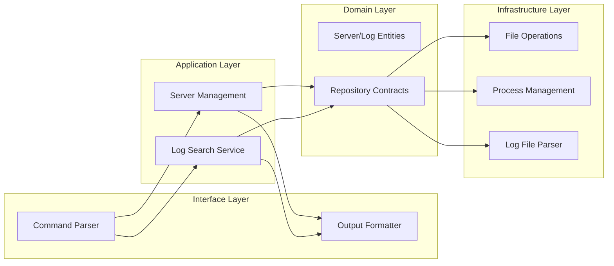
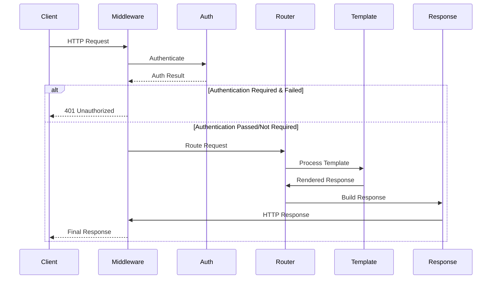
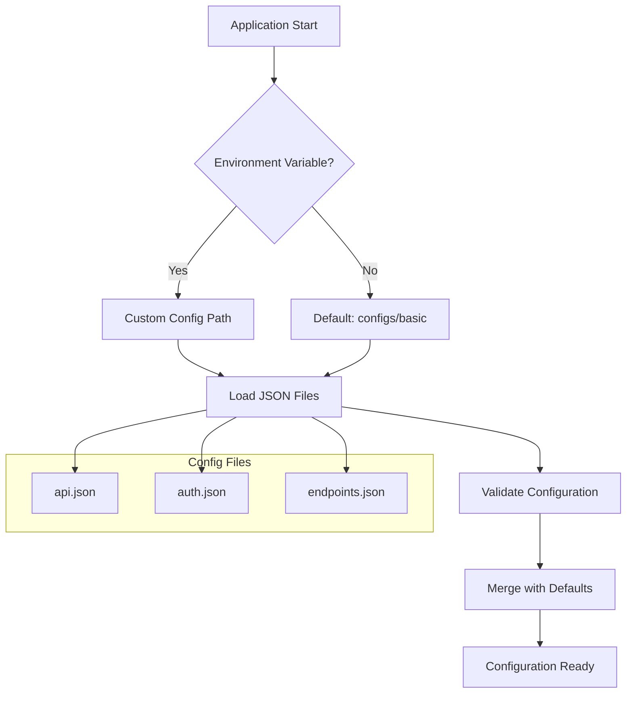
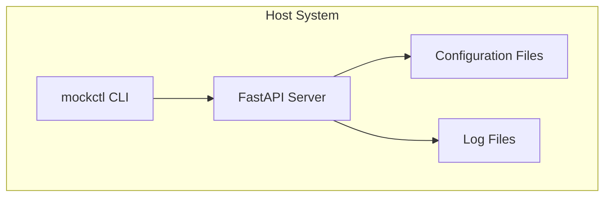
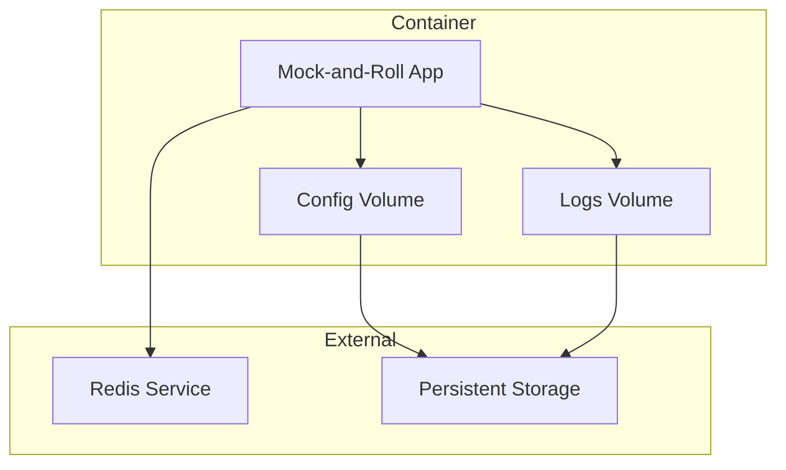

# Architecture Overview

Understanding the design and structure of Mock-and-Roll.

## System Architecture

Mock-and-Roll follows a clean, modular architecture designed for extensibility and maintainability.



## Core Components

### 1. CLI Layer (`src/cli/`)

The command-line interface provides user interaction and server management.

**Structure:**
```
src/cli/
├── interface/          # User interface (commands, presentation)
├── application/        # Application services (server management)
├── domain/            # Domain entities and contracts
├── infrastructure/    # External concerns (filesystem, processes)
└── examples/          # Extension examples
```

**Key Responsibilities:**
- Server lifecycle management
- Log searching and analysis
- Configuration validation
- User interface and feedback

### 2. Web Application (`src/app/`)

FastAPI-based web application that serves the mock API.

**Components:**
- **Application Factory** (`factory.py`) - Creates and configures FastAPI app
- **Route Handlers** (`handlers/`) - Dynamic endpoint processing
- **Middleware** (`middleware/`) - Request/response processing
- **Authentication** (`auth/`) - Security layer

### 3. Configuration System (`src/config/`)

Manages configuration loading and validation.

**Features:**
- Multi-profile support (basic, persistence, vmanage)
- Environment variable override
- JSON schema validation
- Hot-reloading in development

### 4. Dynamic Processing (`src/processing/`)

Handles dynamic response generation and template processing.

**Capabilities:**
- Variable substitution ({{now}}, {{uuid}}, etc.)
- Path parameter extraction
- Conditional response logic
- Request/response transformation

## Design Principles

### 1. Configuration-Driven Development

All behavior is defined through JSON configuration files, enabling:

- **Zero-code customization** - Change behavior without code changes
- **Environment-specific configs** - Different profiles for different use cases
- **Easy testing** - Swap configurations for different test scenarios
- **Rapid prototyping** - Quick setup of new API scenarios

### 2. Clean Architecture

The system follows clean architecture principles:

- **Domain-Driven Design** - Clear separation of business logic
- **Dependency Inversion** - High-level modules don't depend on low-level details
- **Single Responsibility** - Each component has one clear purpose
- **Interface Segregation** - Small, focused interfaces

### 3. Extensibility

The architecture supports easy extension:

- **Plugin System** - Add new authentication methods
- **Custom Middleware** - Inject custom processing logic
- **Template Functions** - Add new template variables
- **Configuration Profiles** - Create domain-specific setups

## Component Details

### CLI Architecture

The CLI follows hexagonal architecture with clear separation:



### Web Application Flow

Request processing follows this flow:



### Configuration Loading

Configuration is loaded hierarchically:



## Data Flow

### Request Processing

1. **Request Reception** - FastAPI receives HTTP request
2. **Middleware Processing** - Logging, CORS, etc.
3. **Authentication** - Validate credentials if required
4. **Route Matching** - Find matching endpoint configuration
5. **Template Processing** - Replace variables, apply conditions
6. **Response Generation** - Create HTTP response
7. **Logging** - Record request/response details

### Log Searching

1. **Pattern Input** - User provides search pattern
2. **File Discovery** - Find relevant log files
3. **Log Parsing** - Parse log entries into structured data
4. **Pattern Matching** - Apply regex/text matching
5. **Result Aggregation** - Group and summarize results
6. **Output Formatting** - Present results in requested format

## Performance Considerations

### Memory Management

- **Lazy Loading** - Configuration loaded on demand
- **Streaming Logs** - Process large log files incrementally
- **Cached Templates** - Compile templates once, reuse many times
- **Connection Pooling** - Reuse Redis connections when available

### Scalability

- **Async Processing** - FastAPI async/await throughout
- **Process Isolation** - Each server runs in separate process
- **Resource Limits** - Configurable limits on responses, logs
- **Efficient Search** - Optimized log parsing and pattern matching

## Security Architecture

### Authentication Layers

1. **System Authentication** - Administrative access to management endpoints
2. **API Authentication** - User access to mock API endpoints
3. **Configuration Security** - File-based access control

### Security Features

- **API Key Management** - Configurable valid keys
- **Request Logging** - Full audit trail
- **Input Validation** - Prevent injection attacks
- **Resource Limits** - Prevent abuse

## Extension Points

### Adding New Authentication Methods

1. Implement auth handler in `src/auth/`
2. Register in authentication configuration
3. Update configuration schema
4. Add tests and documentation

### Custom Template Functions

1. Add function to `src/processing/templates.py`
2. Register with template engine
3. Document usage patterns
4. Add validation logic

### New Configuration Profiles

1. Create directory in `configs/`
2. Define JSON configuration files
3. Test with validation tools
4. Document profile purpose and usage

## Testing Strategy

### Unit Tests

- **Domain Logic** - Business rules and entities
- **Template Processing** - Variable substitution and conditions
- **Configuration Loading** - Schema validation and merging
- **Authentication** - Security logic and edge cases

### Integration Tests

- **API Endpoints** - Full request/response cycles
- **CLI Commands** - Command parsing and execution
- **Configuration Profiles** - End-to-end profile testing
- **Log Searching** - Search functionality with real logs

### Performance Tests

- **Response Times** - Measure endpoint performance
- **Memory Usage** - Monitor resource consumption
- **Concurrent Requests** - Load testing capabilities
- **Log Processing** - Search performance with large files

## Deployment Architecture

### Standalone Deployment



### Container Deployment



## Future Architecture Considerations

### Microservices Evolution

- **Service Decomposition** - Split into focused services
- **Event-Driven Architecture** - Async communication patterns
- **Service Discovery** - Dynamic service registration
- **Load Balancing** - Multiple instance management

### Advanced Features

- **GraphQL Support** - Alternative query interface
- **WebSocket Simulation** - Real-time communication mocking
- **Database Integration** - Direct database mocking
- **Metrics Collection** - Advanced monitoring and analytics

This architecture provides a solid foundation for current needs while maintaining flexibility for future enhancements.
