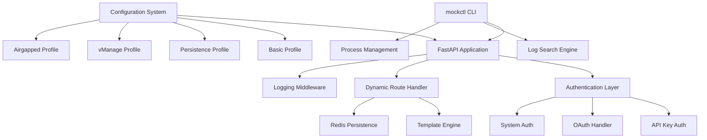
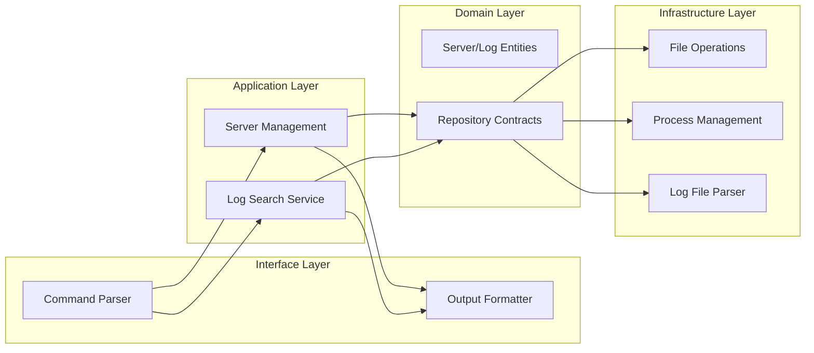
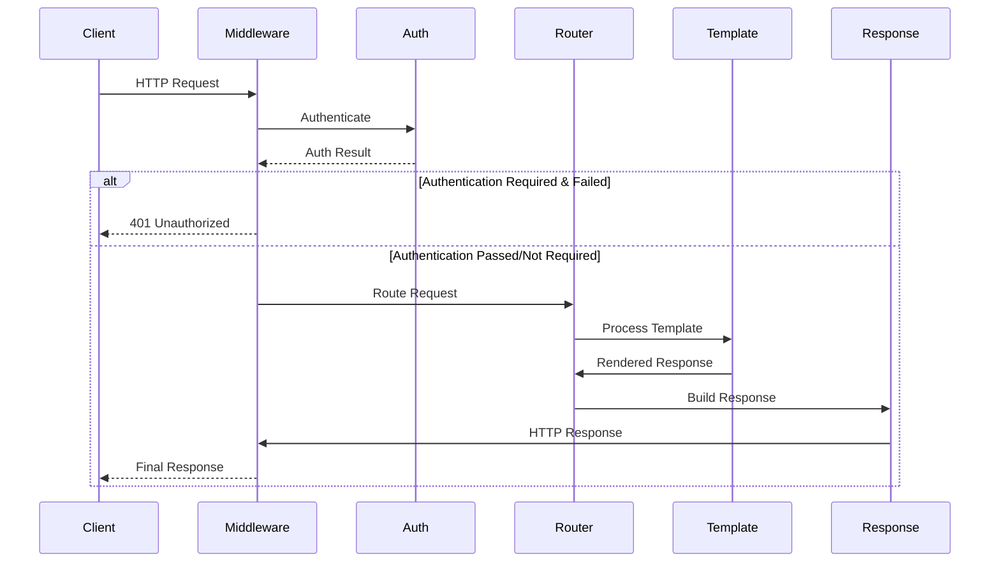
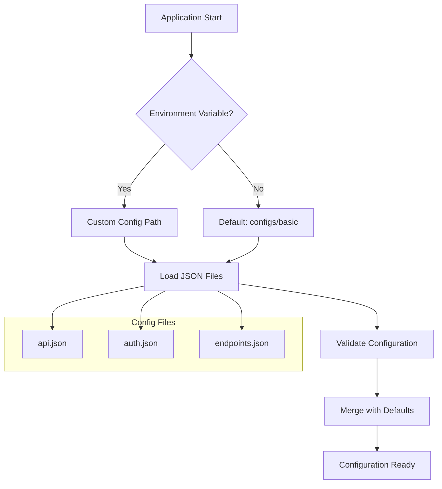
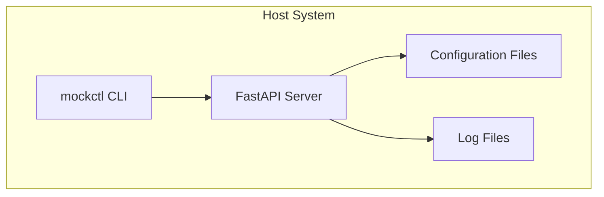
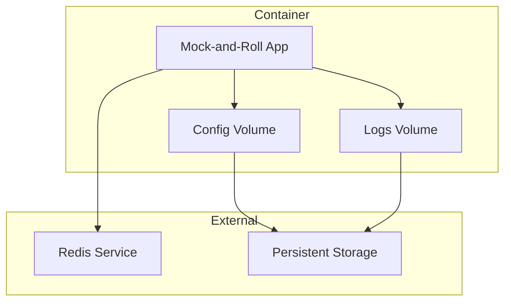

# Architecture Overview

Understanding the design and structure of Mock-and-Roll.

## System Architecture

Mock-and-Roll follows a clean, modular architecture designed for extensibility and maintainability.



## Core Components

### 1. CLI Layer (`src/cli/`)

The command-line interface provides user interaction and server management.

**Structure:**

```
src/cli/
├── interface/          # User interface (commands, presentation)
├── application/        # Application services (server management)
├── domain/            # Domain entities and contracts
├── infrastructure/    # External concerns (filesystem, processes)
└── examples/          # Extension examples
```

**Key Responsibilities:**

- Server lifecycle management (start, stop, list, cleanup)
- Log searching and analysis with regex support
- Process management and monitoring
- User interface and feedback
- Configuration profile selection

### 2. Web Application (`src/app/`)

FastAPI-based web application that serves the mock API.

**Components:**

- **Application Factory** (`factory.py`) - Creates and configures FastAPI app
- **Route Handlers** (`handlers/`) - Dynamic endpoint processing
- **Middleware** (`middleware/`) - Request/response processing
- **Authentication** (`auth/`) - Security layer

### 3. Configuration System (`src/config/`)

Manages configuration loading and validation.

**Features:**

- Multi-profile support (basic, persistence, vmanage, airgapped)
- Environment variable override
- JSON-based configuration files
- Profile-specific settings

### 4. Dynamic Processing (`src/processing/`)

Handles dynamic response generation and template processing.

**Capabilities:**

- Variable substitution ({{random_uuid}}, {{current_timestamp}}, {{timestamp}}, {{date}}, {{unix_timestamp}}, {{unix_timestamp_ms}})
- Authentication placeholder resolution
- Path parameter extraction
- Conditional response logic (body_conditions, path_conditions)
- Automatic timestamp replacement for static values

## Design Principles

### 1. Configuration-Driven Development

All behavior is defined through JSON configuration files, enabling:

- **Zero-code customization** - Change behavior without code changes
- **Environment-specific configs** - Different profiles for different use cases
- **Easy testing** - Swap configurations for different test scenarios
- **Rapid prototyping** - Quick setup of new API scenarios

### 2. Clean Architecture

The system follows clean architecture principles:

- **Domain-Driven Design** - Clear separation of business logic
- **Dependency Inversion** - High-level modules don't depend on low-level details
- **Single Responsibility** - Each component has one clear purpose
- **Interface Segregation** - Small, focused interfaces

### 3. Extensibility

The architecture supports extension through:

- **Custom Authentication Methods** - Add new auth handlers in `src/auth/`
- **Custom Middleware** - Inject custom processing logic in `src/middleware/`
- **Configuration Profiles** - Create domain-specific setups in `configs/`
- **Template Variables** - Extend template processing in `src/processing/templates.py`

**Note:** While the architecture is designed for extensibility, adding new template variables or authentication methods requires code changes. The primary extension mechanism is through configuration profiles.

## Component Details

### CLI Architecture

The CLI follows hexagonal architecture with clear separation:



### Web Application Flow

Request processing follows this flow:



### Configuration Loading

Configuration is loaded hierarchically:



## Data Flow

### Request Processing

1. **Request Reception** - FastAPI receives HTTP request
2. **Middleware Processing** - Logging, CORS, etc.
3. **Authentication** - Validate credentials if required
4. **Route Matching** - Find matching endpoint configuration
5. **Template Processing** - Replace variables, apply conditions
6. **Response Generation** - Create HTTP response
7. **Logging** - Record request/response details

### Log Searching

1. **Pattern Input** - User provides search pattern
2. **File Discovery** - Find relevant log files
3. **Log Parsing** - Parse log entries into structured data
4. **Pattern Matching** - Apply regex/text matching
5. **Result Aggregation** - Group and summarize results
6. **Output Formatting** - Present results in requested format

## Performance Considerations

### Memory Management

- **Configuration Caching** - Configuration loaded once at startup
- **Streaming Logs** - Process large log files incrementally
- **Connection Pooling** - Reuse Redis connections when persistence is enabled
- **Efficient Response Processing** - Direct response generation without caching

### Scalability

- **Async Processing** - FastAPI async/await throughout
- **Process Isolation** - Each server runs in separate process
- **Resource Limits** - Configurable limits on responses, logs
- **Efficient Search** - Optimized log parsing and pattern matching

## Security Architecture

### Authentication Layers

1. **System Authentication** - Administrative access to management endpoints
2. **API Authentication** - User access to mock API endpoints
3. **Configuration Security** - File-based access control

### Security Features

- **API Key Management** - Configurable valid keys in auth.json
- **Token-based Authentication** - Support for Bearer tokens and session cookies
- **Request Logging** - Full audit trail of all requests
- **Input Validation** - FastAPI automatic validation
- **CORS Configuration** - Configurable cross-origin settings

**Note:** The system does NOT currently implement scope validation or fine-grained permission checks.

## Extension Points

### Adding New Authentication Methods

1. Implement auth handler in `src/auth/security.py`
2. Add configuration in `auth.json`
3. Update `verify_auth()` function to handle new method
4. Add tests and documentation

### Custom Template Variables

1. Add variable handling to `src/processing/templates.py`
2. Implement in `process_response_body()` function
3. Document usage patterns
4. Add unit tests for new variable

### New Configuration Profiles

1. Create directory in `configs/` (e.g., `configs/myprofile/`)
2. Define JSON configuration files:
   - `api.json` - API metadata and settings
   - `auth.json` - Authentication configuration
   - `endpoints.json` - Endpoint definitions
3. Test profile with `mockctl start myprofile`
4. Document profile purpose and usage

**Note:** Configuration profiles are the primary extension mechanism and do not require code changes.

## Testing Strategy

### Unit Tests

- **Domain Logic** - Business rules and entities
- **Template Processing** - Variable substitution and conditions
- **Configuration Loading** - Schema validation and merging
- **Authentication** - Security logic and edge cases

### Integration Tests

- **API Endpoints** - Full request/response cycles
- **CLI Commands** - Command parsing and execution
- **Configuration Profiles** - End-to-end profile testing
- **Log Searching** - Search functionality with real logs

### Performance Tests

- **Response Times** - Measure endpoint performance
- **Memory Usage** - Monitor resource consumption
- **Concurrent Requests** - Load testing capabilities
- **Log Processing** - Search performance with large files

## Deployment Architecture

### Standalone Deployment



### Container Deployment



## Best Practices

### Configuration Management

- **Version Control** - Store configuration profiles in version control
- **Environment-Specific Profiles** - Create separate profiles for dev, test, prod
- **Documentation** - Document custom profiles with README files
- **Testing** - Validate configurations before deployment

### Security

- **Credential Management** - Never commit real credentials in configuration files
- **Access Control** - Restrict file system access to configuration directories
- **Audit Logging** - Enable comprehensive request logging for security monitoring
- **Regular Updates** - Keep dependencies updated for security patches

### Performance

- **Redis Connection Pooling** - Configure appropriate pool sizes for persistence profile
- **Log File Rotation** - Implement log rotation to prevent disk space issues
- **Process Management** - Monitor and restart servers as needed
- **Resource Limits** - Set appropriate limits for production environments

This architecture provides a solid foundation for creating flexible, configurable mock API servers that can simulate a wide variety of API behaviors.
