# Diagrams and Visualizations

This page demonstrates the various types of diagrams available in the Mock-and-Roll documentation using Mermaid.

## Architecture Diagrams

### System Overview

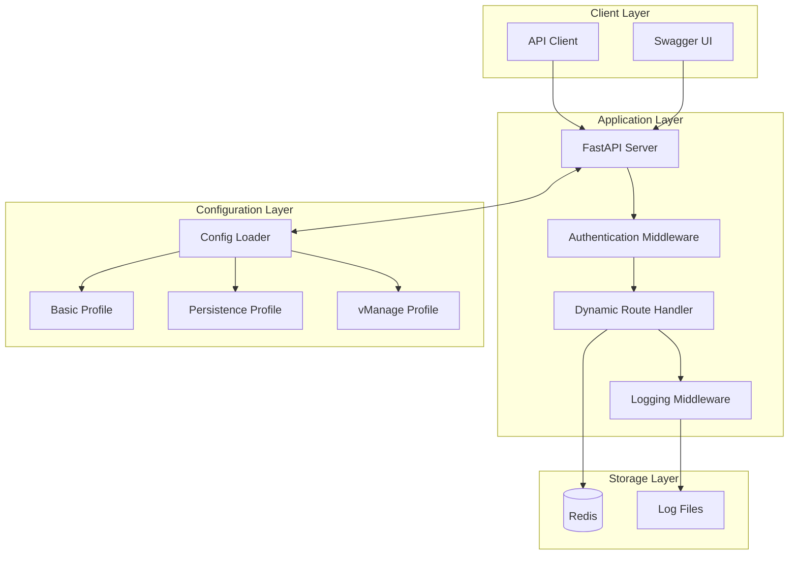

### CLI Architecture

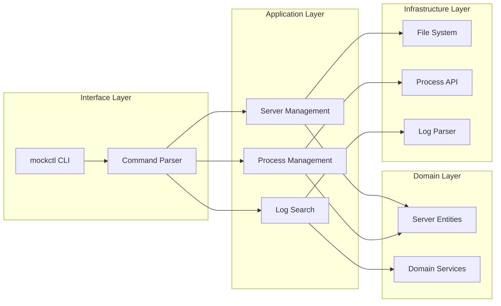

## Request Flow Diagrams

### API Request Processing

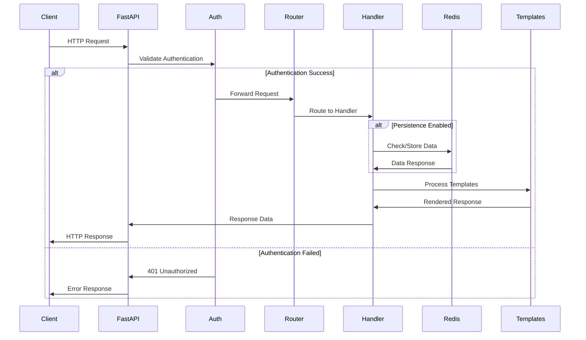

### CLI Server Management

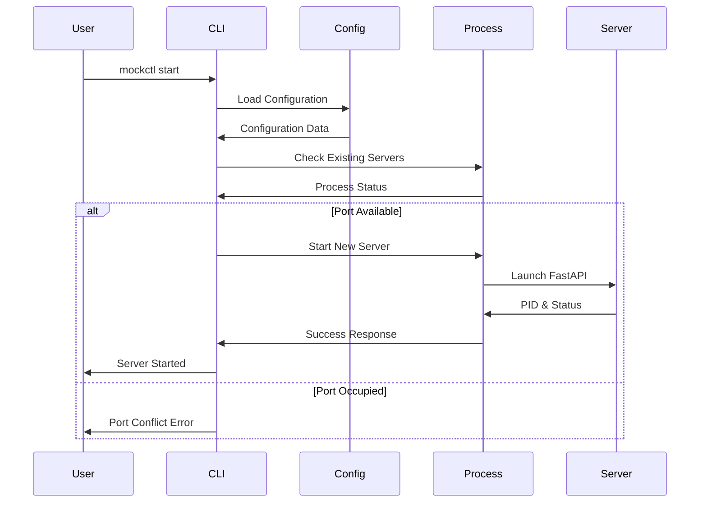

## State Diagrams

### Server Lifecycle

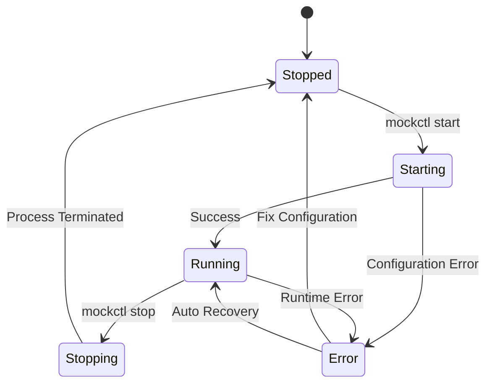

### Authentication Flow

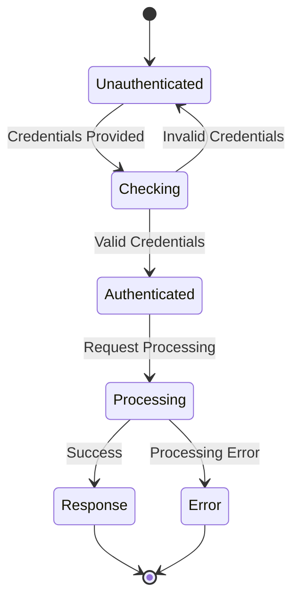

## Data Flow Diagrams

### Configuration Loading

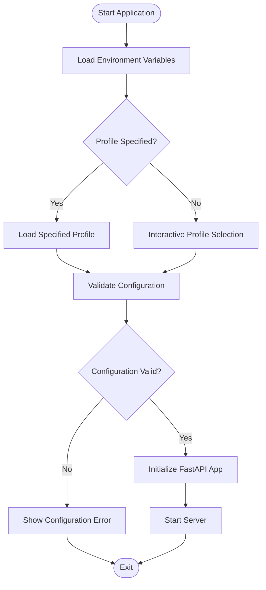

### Log Search Process

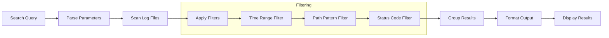

## Component Diagrams

### Plugin Architecture

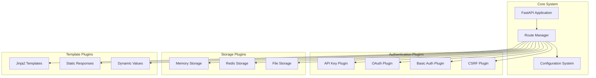

## Class Relationships

### Domain Model

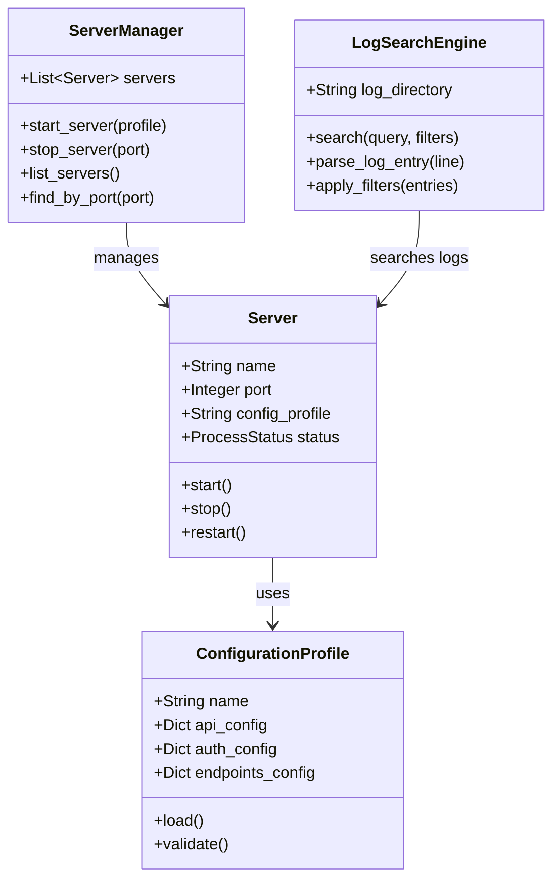

## Timeline Diagrams

### Development Timeline

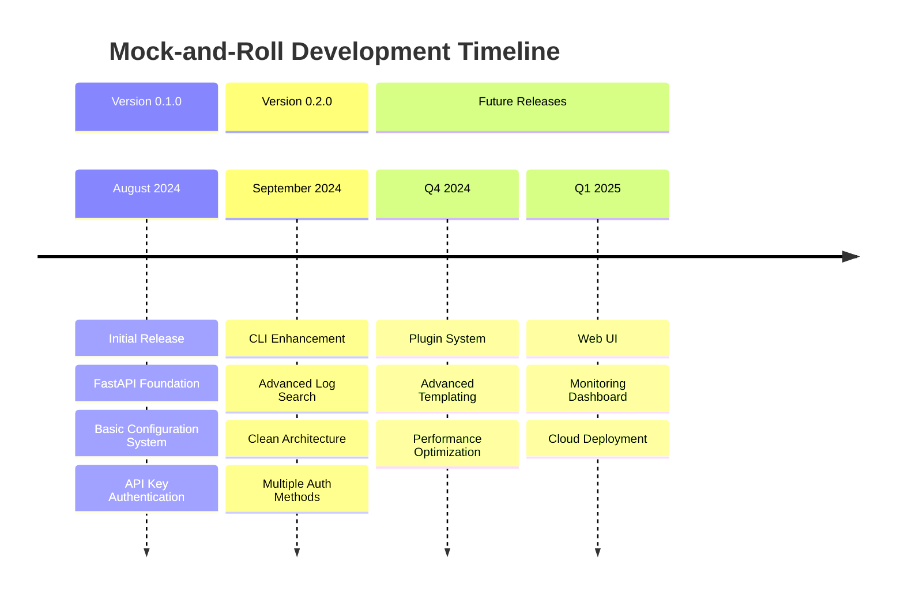

## Usage Examples

### Basic Mermaid Syntax

To add a Mermaid diagram to your documentation, use the following syntax:

````markdown
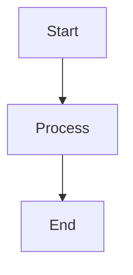
````

### Supported Diagram Types

The following Mermaid diagram types are supported:

- **Flowcharts**: `graph TD`, `graph LR`
- **Sequence Diagrams**: `sequenceDiagram`
- **State Diagrams**: `stateDiagram-v2`
- **Class Diagrams**: `classDiagram`
- **Entity Relationship**: `erDiagram`
- **User Journey**: `journey`
- **Gantt Charts**: `gantt`
- **Pie Charts**: `pie`
- **Timeline**: `timeline`

### Theme Support

Mermaid diagrams automatically adapt to the documentation theme:

- **Light Mode**: Clean, professional appearance
- **Dark Mode**: Optimized colors for dark backgrounds
- **Auto Theme**: Automatically switches based on user preference

The `theme: auto` configuration ensures diagrams look great in both light and dark modes!
